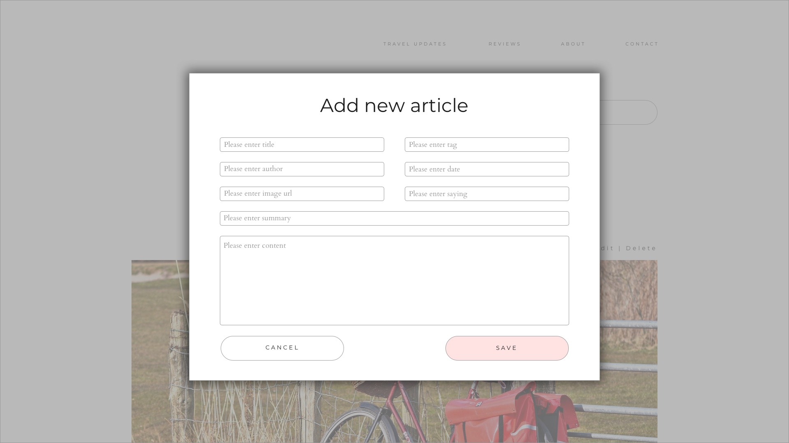

# Implement same app with Angular

## Table of contents

- [About Angular](#about-angular)
- [Play with Angular](#play-with-angular)

## About Angular

- is a platform that makes it easy to build applications with the web
- combines declarative templates, dependency injection, end to end tooling and integrated best practices
- empowers developers to build applications for web, mobile or desktop

> **Note**
>
> More info about Angular can be found on [official website](https://angular.io)

## Play with Angular

Let's create our Travelling Blog application using Angular. You can find the design specifications for this workshop in
[Design Information Section](Design/README.md).

### Articles

### Modal

### Article

