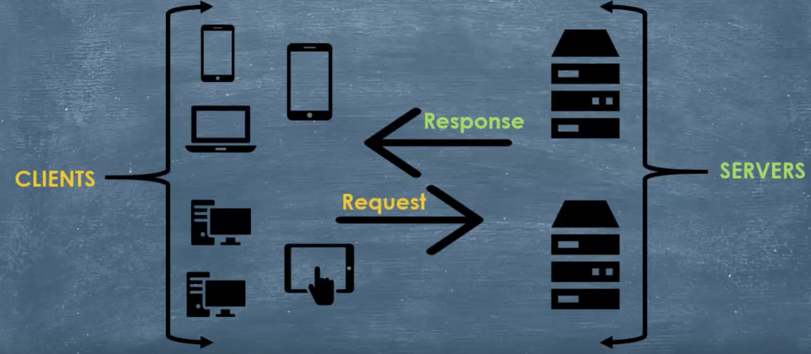
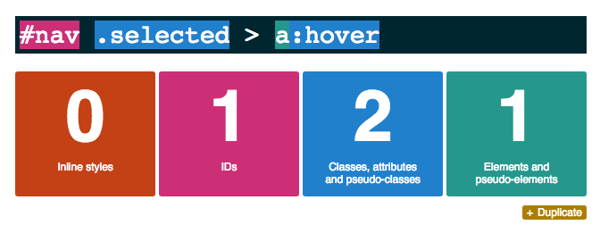
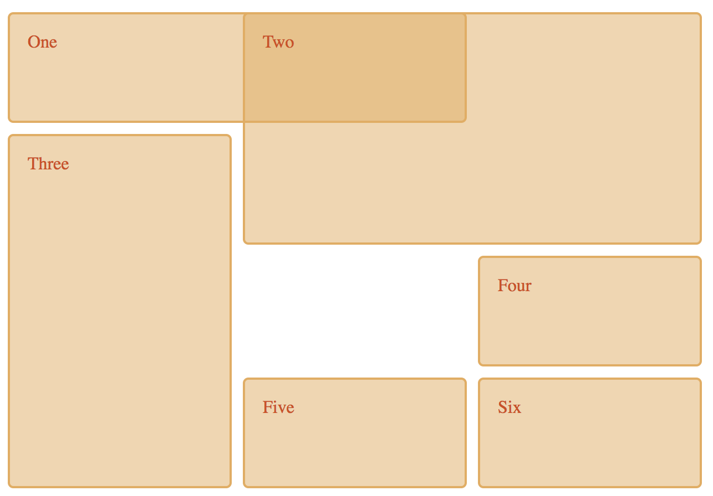

# Day 1 : HTML & CSS

## Table of contents

- [What is a Webpage?](#what-is-a-webpage)
- [First Webpage created](#first-webpage-created)
- [Types of Webpages](#types-of-webpages)
  - [Static Webpages](#static-webpages)
  - [Dynamic Webpages](#dynamic-webpages)
- [Difference between a Webpage, a Website and a Web Application](#difference-between-a-webpage-a-website-and-a-web-application)
  - [Webpage](#webpage)
  - [Website](#website)
  - [Web Application](#web-application)
- [Client-Server model](#client-server-model)
  - [Client](#client)
  - [Server](#server)
  - [How does the Client-Server model works?](#how-does-the-client-server-model-works)
- [HTTP Protocol](#http-protocol)
- [HTML Page Structure](#html-page-structure)
  - [HTML Basic Tags](#html-basic-tags)
  - [Semantic HTML](#semantic-html)
- [Let's add some style using CSS](#lets-add-some-style-using-css)
  - [About CSS](#about-css)
  - [Style element](#style-element)
  - [Include External CSS](#include-external-css)
  - [Representing colors in CSS](#representing-colors-in-css)
  - [Simple Selectors](#simple-selectors)
  - [More Complex Selectors](#more-complex-selectors)
  - [Pseudo-class](#pseudo-class)
  - [Pseudo-element](#pseudo-element)
  - [Specifying CSS Property Values](#specifying-css-property-values)
  - [Specificity](#specificity)
  - [Inheritance](#inheritance)
  - [The box Three](#the-box-three)
  - [Padding, Margin, Border](#padding-margin-border)
  - [Display and Visibility](#display-and-visibility)
  - [Position](#position)
  - [Flexbox](#flexbox)
  - [CSS Grid](#css-grid)
  - [Responsive Web Design](#responsive-web-design)
  - [Media Query](#media-query)

## What is a Webpage?

- is a document commonly written in **HTML** (***HyperText Markup Language***)
- is accesible through the internet using any web browser (*Google Chrome*, *Opera*, *Safari*, *Mozilla Firefox* and so on)
- may contain text, audio, video, downloadable data files, hyperlink to other web pages
- can be viewed by entering correct URL pointing to the Web page

## First Webpage created

- First Webpage was created in 1991 by Tim Berners Lee.
- He published it from a lab in the Swiss Alps.
- The page is still up nowadays, but it was updated many times from then.
- It was created to explain the World Wide Web concept to the newcomers.
- If you are curious to see how it looks like, visit [World's first Website](http://info.cern.ch/hypertext/WWW/TheProject.html).

## Types of Webpages

### Static Webpages

- shows the same content each time access it
- *e.g. : HTML Webpage*

### Dynamic Webpages

- changes the content each time access it
- are usually witten in Scripting Languages such as PHP, JSP, ASP, Perl etc.
- Sscripting Languages return information in HTML form from a Database. Then, the browser translate the HTML to computer understandable language
- *e.g. : a Webpage displaying current date and time*

## Difference between a Webpage, a Website and a Web Application

### Webpage

- Single document written using HTML
- Can be accessed by entering its URL (Uniform Resource Locator) address in a Web Browser

### Website

- A group of **interlinked** and **well-structured** web pages that exist on the same domain
- We move from one page to another using **hyperlinks**
- As there exists 2 types of webpages, there are 2 types of websites also: **static** (contains only static web pages) and **dynamic** (contains dynamic web pages)

### Web Application

- A **software program** that exists on the server and run using a web browser, through a web page
- Created using a combination of **programming languages** and **web application frameworks**
- It may use the RAM, allow user interactivity and it is designed for many uses
- Based on **user engagement**
- *e.g. : YouTube application*

## Client-Server model

**The web** is a service that allows computers to share and exchange data, such as: images, videos, documents etc.

The web is reffered to as **Client-Server** communication:

- computers that ask for data, so these are **Clients**
- computers that give the data, calling also *computers that serve*, so this is the **Servers**

### Client

- is a way to make requests through the web
- can be a machine or a program
- ***Client Machine*** is the device that the user can use to access the web (e.g. : laptop, desktop, smartphones)
- ***Client Program*** is a program that allows the user to ***make requests*** (*e.g. : Web Browser*)

### Server

- is a computer program, **NOT** a device
- by extension, the server is a high-performance computer, but it is called server because it runs **server programs**
- provide functionality and **serve** other programs called clients
- a single server can **serve multiple clients at the same time**, that is the reason why we need servers to be *super-computers*
- **multiple servers** can run on a **single machine**
- there are many types of servers:
  - **Web servers** (*Apache*) - serve **HTTP** requests
  - **Database servers** - run Database Management Systems
- can contain web resources, host web applications, stores user and program data etc.
- is always listening for requests and as soon as it receives one, responds with a message

### How does the Client-Server model works?

It is an architecture on the web that splits computers into 2 sections:

- computers that asks for and request services (**Clients**)
- computers that serve clients (**Servers**)



> **Note**
>
> - The Client-Server model is just one way for the computers to communicate via the web.
> - It is based on a **centralized structure**
> - There is another way to communicate via a **decentralized structure** - ***The Peer to Peer Model***
> - In The Peer to Peer Model:
>   - There is no client and no server
>   - Both computers can be requesters and response providers
>   - Each one is able to send and receive data directly with one another
>   - *e.g. : Videochat protocols*

## HTTP Protocol

- Most used protocol in the world
- **HTTP** comes from: **Hypertext Transfer Protocol**
- It is an **application layer protocol** allowing web applications to communicate and exchange data
- **TCP/IP based** protocol
- Used to **deliver contents** (*images, videos, documents etc.*)
- It is a **connectionless** protocol: after making the request, the client **disconnect** from the server; then, when the response is ready, the server **re-estabilish** the connection and deliver the response
- Can deliver all sort of data, as long as the computers are **able to read** it.
- It is a **stateless** protocol: the client and the server know about each other **just durring the current request**. If they wants to reconnect, will estabilish a new connection as the first time.
- Was designed for the Web in the first place
- A typical HTTP message contains:
  - Start line - contain plain text information
  - Headers - contain plain text information
  - Body - sometimes contains binary data
- The information found in these three sections **vary depending if there is a request or response**:


&nbsp;


## HTML Page Structure

- A HTML element usually consists of a **start** tag and **end** tag, with the content inserted between them:

```HTML
<tagname>Some HTML content...</tagname>
```

- There is a sample of HTML page document:

```HTML
<html>
  <head>
    <title>Sample Web page</title>
  </head>
  <body>
    <table border="0" cellpadding="10">
      <tr>
        <td>
          
        </td>
        <td>
          <h1>Sample "Hello, World" Application</h1>
        </td>
      </tr>
    </table>
    <p>This is the home page for the Web application. </p>
  </body>
</html>
```

- From the sample below, can be seen that all content is between **html** tags.
- Next, we have:
  - a declarative header section (delimited by the **head** element)
  - a body, which contains the document's actual content (delimited by **body** element)

### HTML Basic Tags

**Heading tags: *&lt;h1&gt;,&lt;h2&gt;,&lt;h3&gt;,&lt;h4&gt;,&lt;h5&gt;,&lt;h6&gt;***

- Any document starts with a heading
- The headings may have 6 different sizes, which use the following elements: *&lt;h1&gt;,&lt;h2&gt;,&lt;h3&gt;,&lt;h4&gt;,&lt;h5&gt;,&lt;h6&gt;*.

**Paragraph Tag - *&lt;p&gt;***

- The *&lt;p&gt;* tag offers a way to structure the text into different paragraphs

**Line break Tag - *&lt;br /&gt;***

- After using the *&lt;br /&gt;* tag, anything following it starts from the next line.
- This is an example of **empty** element, when no opening or closing tags are needed, because there is nothing to go between them

**Centering content - *&lt;center&gt;***

- This tag is used to put any content in the center of the page.

**Preserve formatting - *&lt;pre&gt;***

- Sometimes it is needed to keep the exact format as it is written; *&lt;pre&gt;* tag may be used for this purpose.

**Nonbreaking Spaces - *\&nbsp;***

- To make client browser not to break text, *\&nbsp;* space entity should be used.

> **Note**
>
> This is just a quick preview of some samples of HTML tags. The whole list can be found at [w3schools](https://www.w3schools.com/tags/ref_byfunc.asp)

### Semantic HTML

- refers to the idea that all HTML markup should convey the underlying meaning of the content - not its appearance
- it is about using **tags**, **class names** and **ids** that reinforce the **meaning of the content** within the tags
- It is an additional layer of communication. Real people looking only at how your page displays may never get that additional communication, but machines will (like screen readers and search engines)
- **Semantic HTML** is important because it is:
  - **More accessible**: it can be better understood by a greater variety of devices
  - **Search engine friendly**: search engines rank content and not code, but using semantics to understand content
  - **Clean**: easier to read and edit
- See some examples of using [Semantic HTML](https://internetingishard.com/html-and-css/semantic-html/)

## Let's add some style using CSS

- **CSS1**, first introduced in 1996, with the features: fonts, colors, alignment and spacing
- **CSS2.1**, released in 2004, added to previous features: layout and positioning
- **CSS3** has additional features regarding effects, sizing and speech
- There is **no CSS4**, the language has no longer levels - only the modules will be versioned

### About CSS

- **C**ascading **S**tyle **S**heets
- while HTML gives the structure of the content, CSS gives a way to describe how the content should be presented
- whem the browser displays HTML, it uses its own built-in default style
- can control the displaying style of multiple web pages at once
- external stylesheets are stored in **CSS files**

### Style element

- **&lt;style&gt;** element helps to add some design to the web page
- placed inside the head of HTML
- just like other tags, it has an opening tag and a closing one
- but the &lt;style&gt; tag also requires an **attribute** called **type** which tells the browser the king of style used. In this case, it will be **text/css**
- an **attribute** provides additional information about an element
- there are not currently any other styles that work with today's browsers, but **type** attribute was created to anticipate possible future ones
- *e.g.:*

```HTML
<html>
  <head>
    <title>Stylized page</title>
    <style type="text/css">
      body {
        background-color: red;
        margin-left: 20px;
        margin-right: 20px;
        border: 1px dotted gray;
        padding: 10px;
        font-family: sans-serif;
      }
    </style>
  </head>
  <body>
    Some content here
  </body>
</html>
```

- Let's analyze the content between *&lt;style&gt;* tags:
  - **body** : is the selector, the content between curly braces follow the template: **propertyName: value**
  - **background-color** : sets the background color to the desired one
  - **margin-left**, **margin-right** : sets the left and right margins to some values
  - **border** : defines a border deisgned with specific width, style and color
  - **padding**: creates some padding
  - **font-family** : defines the font to use for text

### Include External CSS

- Styles are usually included into external CSS files
- With an external style sheet, look of the entire site can be changed by modifying one file
- To use an external style sheet, a link can be added in the **&lt;head&gt;** section of the HTML page:

```HTML
<!DOCTYPE html>
<html>
  <head>
    <link rel="stylesheet" href="styles.css">
  </head>
  <body>
    <p>This is a paragraph.</p>
  </body>
</html>
```

```CSS
body {
  background-color: yellow;
}
p {
  color: red;
}
```

### Representing colors in CSS

- **Hexadecimal colors : *#RRGGBB***
  - components of the color: RR(red), GG(green) and BB(blue) hexadecimal integers between 00 and FF
  - *e.g. : #0000FF is blue*
- **RGB colors : *rgb(red, green, blue)***
  - each parameter defines the intensity of the color and can be an integer between 0 and 255
  - *e.g. : rgb(0, 0, 255) is blue*
- **RGBA colors : *rgba(red, green, blue, alpha)***
  - extension of RGB colors
  - *alpha* parameter is a number between 0.0 (fully transparent) and 1.0 (fully opaque)
  - *e.g. : rgba(0, 0, 0, 255, 0.3) is blue with opacity*
- **HSL Colors: *hsl(hue, saturation, lightness)***
  - hue is a degree on the color wheel (from 0 to 360, 0 or 360 is red, 120 is green, 240 is blue), saturation is a percentage value (0% means a shade of gray and 100% is the full color) and lightness is also a percentage (0% is black, 100% is white)
  - *e.g. : hsl(240, 60%, 70%) is pastel blue*
- **HSLA Colors : *hsla(hue, saturation, lightness, alpha)***
  - extension of HSL colors
  - *alpha* parameter is a number between 0.0 (fully transparent) and 1.0 (fully opaque)
  - *e.g. : hsla(240, 60%, 70%, 0.3) is pastel blue with opacity*
- **Predefined/Cross-browser colors**
  - there are 140 color names predefined in CSS specification
  - *e.g.: Aqua, Blue, Brown*

### Simple Selectors

- A selector is a pattern used to apply patterns to elements
- There are 3 types of simple selectors:
  - **based on the type of element**
    - *e.g.: the previous **body** selector will select all body elements in HTML*
  - **based on class**
    - *e.g. : **.bookTitle** identifies the HTML elements matching *bookTitle* class atrribute*
  - **based on id**
    - *e.g.: **#menu** : will select all elements which have the id named menu*
- Same CSS properties may be applied to multiple selectors, by separating them by comma:
  - *e.g.: h1, h2 {...}*
- Also, for selecting everything, **star selector (*)** can be used

```CSS
nav {
  background-color:#ddd;
}

.container {
  margin: 0 auto;
}

#about {
  padding: 0 30px 25px 5px;
}

h1, h2, h3 {
  color: #000;
}

```

### More Complex Selectors

- **Descendant selector** - apply the style for all **p** elements anywhere inside of **div** elements

```CSS
div p {
  background-color:#ddd;
}
```

```HTML
<div>
  <article>
      <p>I'm a descendant</p>
  </article>
  <p>I'm also a descendant</p>
</div>
```

- **Child selector** - apply the style for all **p** elements that are direct descendants (childs) of **div** elements

```CSS
div > p {
  background-color:#ddd;
}
```

```HTML
<div>
  <article>
      <p>I'm a descendant but not a child</p>
  </article>
  <p>I'm a child and also a descendent</p>
</div>
```

- **Chain selector** - apply the style for all **div** elements that contain the class  **mark**

```CSS
div.mark {
  background-color:#ddd;
}
```

```HTML
<div>
  <article class="mark">
      I'm not a div
  </article>
  <div class="mark">
    I'm a marked div :)
  </div>
</div>
```

- **Attribute selector** - apply the style for all **img** elements that have the value of *alt* atribute equal to *fruit*

```CSS
img[alt=fruit] {
  padding:0 20px;
}
```

```HTML
</img>
```

- **Pseudo-class** - apply the style for all visited **a** elements (hyperlinks)

```CSS
a:visited {
  color: blue;
}
```

### Pseudo-class

- is used to define a special state of an element. For example, it can be used to:
  - Style an element when a user mouses over it
  - Style visited and unvisited links differently

### Pseudo-element

- is used to style specified parts of an element. For example, it can be used to:
  - Style the first letter or line of an element
  - Insert content before or after the content of an element
- *e.g.: **selector::pseudo-element***

> **Note**
>
> Here there are just a few selectors. In order to see all of possible ones, visit [selectors specs](https://www.w3.org/TR/selectors-3/).

### Specificity

- is a weight that is applied to a given CSS declaration, determined by the number of seach **selector type** in the matching selector
- when multiple delcarations have equal specificity, the last declaration found in the CSS is applied to the element
- only applies when the same element is targeted by multiple declarations
- **directly targeted elements** will always take precedence over rules which an element inherits from its ancestor

```CSS
body > div {
  background-color: red;
}

div {
  background-color: black;
}

* {
  background-color: green;
}
```


The following list of selector types increases by specificity:

- **Type selectors** ( *h1* ) and **pseudo-elements** ( *::before* )
- **Class selectors** ( *.example* ), **attributes selectors** ( *[type="radio"]* ) and **pseudo-classes** ( *:hover* )
- **ID selectors** ( *#example* )
- **Inline styles** added to an element ( *style="font-weight:bold"*) **always overwrite** any styles in external stylesheets => have **the highest specificity**
- **!important** rule is used on a style declaration and this one overrides any other declarations. Using of this one is **bad practice** because it makes debugging more difficult by breaking the natural **cascading**.



> **Note**
>
> We can calculate selector specificity using [Keegan Street calculator](https://specificity.keegan.st/).

### Specifying CSS Property Values

- There are a lot of ways to specify property values (by the property):
  - **Keywords:** *thin, thick, larger*
  - **Physical measurements:** *inches (in), points (pt), picas (pc)*
  - **Screen measurements:** *pixels (px)*
  - **Relative measurements:** *%,em*
  - **Color codes:** *hex, rgb*
  - **Fonts:** *Helvetica, sans-serif*
  - **Functional notation:** *url("images/ex.jpg")*

> **Note**
>
> To learn more easy CSS properties we can use a [Cheet Sheet](https://toptal-email-assets.s3.amazonaws.com/css-cheat-sheet.pdf).

### Inheritance

- some properties will be inherited from the element's parents
  - *e.g. : font-size*
- if we take a look at a make, it looks pretty much as a tree

### The box Three

- An HTML element can be considered as a box
- There are three big properties that can influence this box:
  - **border**: not visible by default, but the width, style and color can be controlled
  - **padding**: the space between the border and the content of the box
  - **margin**: the space between the box and other elements

### Padding, Margin, Border

- Every box has **4 sides**
- CSS allows to set all sides equally or independently

```CSS
ul li {
  padding-right: 10px;
  margin: 0 3px 0 3px;
  border-botton: 3px solid #000;
}
```

- the order of the 4 values from **margin** are: **top, right, bottom and left** ( clockorder ) - this is the short form, to avoid writing 4 lines by writing only one
- **border** also has a shorter form, the 3 values means: **width**, **type** and **color**

> **Note**
>
> When the **top** and **bottom** margins meet, they overlap by taking the maximum of sizes. This rule is applied only for **vertical margins.**

### Display and Visibility

- **Display** is generally **block**, **inline** or **none**
  - **Block elements** sit on top of each other
    - *e.g.: **div** element is a block-level element*
  - **Inline elements** only move downward when there is no enough space
    - *e.g.: **span** element is an inline element*
  - **Display of none** removes an element
- **Visibility**:
  - Elements are visible by default
  - Hidden elements are not visible, but reserve space

### Position

- 4 possible values:
  - **static:**
    - default value
    - an element with **position: static** is not positioned in any special way, it is always positioned according to the normal flow of the page
  - **fixed:**
    - an element with **position: fixed** always stays in the same place even if the page is scrolled
    - it does not leave a gap in the page where it would normally have been located
  - **sticky:**
    - an element with **position: sticky** is positioned based on the user's scroll position
  - **relative:**
    - an element with **position: relative** is positioned relative to its normal position
  - **absolute**
    - an element with **position: absolute** is positioned relative to the nearest positioned ancestor. If there is no positioned ancestor, it uses the document body

### Flexbox

- The **Flexible Box Layout Module** makes it easier to design flexible responsive layout structure without using float or positioning
- Excels at vertical centering and equal heights
- Very easy to reorder boxes
- First, it is needed to define **flex container** (the parent) and **flex items** (the children)
- The flex container becomes flexible by setting the **display** property to **flex**

```CSS
.flex-container {
  display: flex
}
```

- The flex container properties are:
  - **flex-direction**
  - **flex-wrap**
  - **flex-flow**
  - **justify-content**
  - **align-items**
  - **align-content**

- It easily solves one of the most common style problem: **perfect centering**:

```CSS
.flex-container {
  display: flex;
  height: 300px;
  justify-content: center;
  align-items: center;
}
```

- The **direct child elements of a flex container** automatically become flexible (flex) items
- The flex item properties are:
  - **order**
  - **flex-arrow**
  - **flex-shrink**
  - **flex-basis**
  - **flex**
  - **align-self**

- Main disadvantage is that Flexbox was planned to be 1-dimension

> **Note**
>
> To learn flexbox in an easy and funny way, play [Flexbox defence](http://www.flexboxdefense.com/).

### CSS Grid

- Released on March 2017
- Excels at dividing a page into major regions or defining the relationship in terms of size, position and layer
- Like tables, **grid layout** enables the author to align elements into columns and rows
- CSS Grid is designed to work in 2-dimension way - no "row" markup required
- It is better to use Flexbox for UI elements, but use Grid for major layout
- Example for using CSS Grid:

```HTML
<div class="wrapper">
  <div class="one">One</div>
  <div class="two">Two</div>
  <div class="three">Three</div>
  <div class="four">Four</div>
  <div class="five">Five</div>
  <div class="six">Six</div>
</div>
```

```CSS
.wrapper {
  display: grid;
  grid-template-columns: repeat(3, 1fr);
  grid-gap: 10px;
  grid-auto-rows: minmax(100px, auto);
}
.one {
  grid-column: 1 / 3;
  grid-row: 1;
}
.two {
  grid-column: 2 / 4;
  grid-row: 1 / 3;
}
.three {
  grid-column: 1;
  grid-row: 2 / 5;
}
.four {
  grid-column: 3;
  grid-row: 3;
}
.five {
  grid-column: 2;
  grid-row: 4;
}
.six {
  grid-column: 3;
  grid-row: 4;
}
```

The display will be divided in this way:


> **Note**
>
> To learn CSS Grid in an easy and funny way, play [CSS Garden](http://cssgridgarden.com/).

### Responsive Web Design

- makes web pages look good on all devices
- uses only HTML and CSS
- can be viewed using many different devices: desktops, tablets and phones
- the web page should look good and be easy to use, regardless of the device
- it is called responsive web design when CSS and HTML is used in order to resize, hide or move the content to make it look good on any screen

### Media Query

- CSS technique introduced in CSS3.
- uses the **@media** rule to include a block of CSS properties only if a certain condition is true.
- it is added a breakpoint where certain parts of the design will behave differently on each side of the breakpoint.

```CSS
@media only screen and (max-width: 768px) {
  /* For mobile phones: */
  [class*="col-"] {
      width: 100%;
  }
}
@media only screen and (min-width: 600px) {
  /* For tablets: */
  .col-s-1 {
    width: 8.33%;
  }
}
@media only screen and (min-width: 768px) {
  /* For desktop: */
  .col-1 {
    width: 8.33%;
  }
}
```