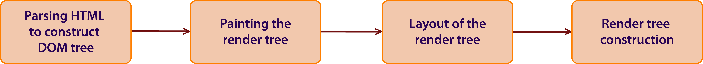
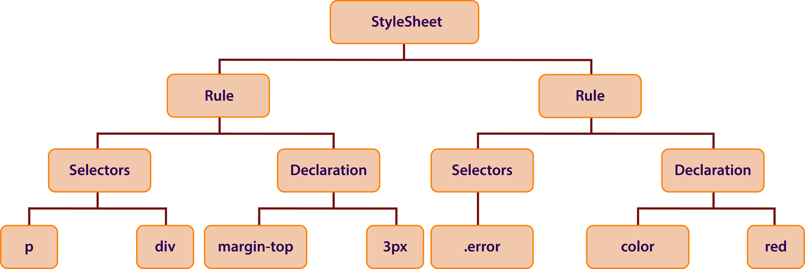

# Day 2 : Basic JavaScript

## Table of contents

- [How browsers work?](#how-browsers-work)
  - [The browser's main functionality](#the-browsers-main-functionality)
  - [The browser's high level structure](#the-browsers-high-level-structure)
  - [The main flow](#the-main-flow)
  - [DOM Intro](#dom-intro)
  - [CSS Parsing](#css-parsing)
  - [Processing scripts and style sheets](#processing-scripts-and-style-sheets)
  - [The rendering engine's threads](#the-rendering-engines-threads)
  - [Event loop](#event-loop)
- [Web Application Programming Interfaces](#web-application-programming-interfaces)
  - [API in client-side JavaScript](#api-in-client-side-javascript)
- [What is JavaScript?](#what-is-javascript)
  - [JavaScript running order](#javascript-running-order)
  - [Interpreted versus compiled code](#interpreted-versus-compiled-code)
  - [How can JavaScript be added to a Web page?](#how-can-javascript-be-added-to-a-web-page)
- [Primitives](#primitives)
  - [Primitive wrapper objects in JavaScript](#primitive-wrapper-objects-in-javascript)
- [Objects](#objects)
  - [Dates](#dates)
  - [Indexed collections: Arrays and Typed Arrays](#indexed-collections-arrays-and-typed-arrays)
  - [Structured data: JSON](#structured-data-json)
- [Functions](#functions)
  - [Function declaration](#function-declaration)
  - [Function expressions](#function-expressions)
  - [Calling functions](#calling-functions)
  - [Function scope](#function-scope)
  - [Arrow functions](#arrow-functions)
- [DOM](#dom)
  - [DOM and JavaScript](#dom-and-javascript)
  - [Data Types](#data-types)
  - [Interfaces in the DOM](#interfaces-in-the-dom)
- [Events](#events)
  - [Inline event handlers](#inline-event-handlers)
  - [addEventListener() and removeElementListener()](#addeventlistener-and-removeelementlistener)

## How browsers work?

- in the years of IE 90% dominance, the browser was like a "black box"
- now, open-source browsers serve the majority of the web, so we can see what's inside a web browser: millions of C++ lines
- as a web developer, **learning the internals of browser operations helps you make better decisions and know the justifications behind development best practices**
- there are 5 major browsers used on desktop today:
  - Chrome
  - Internet Explorer
  - Firefox
  - Safari
  - Opera

### The browser's main functionality

- The main function of a browser is **to present a web resource** (usually a HTML, but may also be image or other type of content), by requesting it from the server and displaying it in the browser's window. The location of the resource is specified by the user using an **URI (Uniform Resource Identifier)**
- The way the browser interprets and displays HTML is specified in the **HTML and CSS specifications**
- specifications are maintained by the [W3C](https://www.w3.org/) (World Wide Web Consortion) organization
- For years browsers conformed to only a part of the specifications and developed their own extensions => browser incompatibility issues
- Today most of the browsers more or less conform to the specifications

### The browser's high level structure

1. **The user interface (UI)** (address bar, back/forward button, bookmarking menu etc.)
2. **The browser engine**: manages actions between the UI and the rendering engine
3. **The rendering engine**: displays the requested content (*e.g.: parses HTML and CSS and displays the parsed content on the screen*). IE uses *Trident*, Firefox uses *Gecko*, Safari uses *WebKit*, Chrome and Opera (from version 15) use *Blink*, a fork of WebKit.
4. **Networking**: for HTTP requests
5. **UI backend**: exposes a generic interface that is not platform specific
6. **JavaScript interpreter**: parse and execute JS code
7. **Data storage**: persistence layer. The browser may need to save all sorts of data locally, such as cookies. Browsers also support storage mechanisms such as *localStorage*, *IndexedDB*, *WebSQL* and *FileSystem*.

> ### **Note**
>
> Browsers such as Chrome run multiple instances of the rendering engine, one for each tab. Each tab runs in a separate process.

### The main flow



- Start **Parsing the HTML** document and convert them to DOM nodes in a tree called **content tree**
- Parse the style data, both in external CSS and in style elements
- Styling information & visual intructions in the HTML => **render tree**
- Render tree contains rectangles with visual attributes, places in right order to be displayed to the screen
- **Layout process**: each node receives the exact coordinates where it should appear on the screen
- **Painting**: each node will be painted using the UI backend layer

> **Note**
>
> - this is a gradual process
> - for better user experience, the rendering engine will try to display contents on the screen as soon as possible (it will not wait until all HTML is parsed before starting to build and layout the render tree, it will start to display parts of it, while the process will continue with the rest of contents)

### DOM Intro

- Coming from **D**ocument **O**bject **M**odel
- The output tree is a tree of DOM element and attribute nodes
- It is the object presentation of the HTML document and the interface of HTML elements
- Like HTML, DOM is specified by the W3C organization
- has an almost one-to-one relation to the markup
- *e.g.:*

```HTML
<html>
    <body>
        <p>
            Hello World
        </p>
        <div>
            
        </div>
    </body>
</html>
```

will be translated to the following DOM tree:


- during the tree construction stage the DOM tree with the Document in its root will be modified and elements will be added to it
- you will never get an "Invalid Syntax" error on an HTML page (browsers fix any invalid content and go on)

### CSS parsing

- Each CSS file is parsed into a StyleSheet object
- Each object contains CSS rules
- CSS rule objects contain selector and declaration objects and other objects corresponding to CSS grammar
- *e.g.:*

```CSS
p, div {
    margin-top: 3px;
}
.error {
    color: red;
}
```

will be translated into:



### Processing scripts and style sheets

#### Scripts

- the model of the web is synchronous
- scripts are expecting to be parsed and executed immediately when the parser reaches a ***&lt;script&gt;*** tag
- parsing of the document stops until the script has been executed
- if the script is external, then the resource must first be fetched from the network
- both WebKit and Firefox do an optimization: while executing scripts, another thread parses the rest of the document and finds out what other resources need to be loaded from the network and loads them (**Speculative parsing**)

#### Style sheets

- it seems that since style sheets don't change the DOM tree, there is no reason to wait for them and stop the document parsing
- there is an edge case: for the scripts asking for style information during the document parsing steps, if the style is not loaded and parsed yet, the script will get wrong answers and this caused lots of problems
- **Firefox blocks all scripts** when there is a style sheet that is still being loaded and parsed
- **WebKit blocks scripts only when they try to access certain style properties that may be affected by unloaded style sheet**

#### Style computation

- visual properties of each render object will be calculated by style properties of each element
- the style includes style sheets of various origins: **inline elements** and **visual properties in the HTML** (*e.g.: bgcolor property*), then is translated to matching CSS style properties

### The rendering engine's threads

- the rendering engine is single threaded
- almost everything, except network operations, happens in a single thread
- network operations can be performed by several parallel threads
- the number of parralel connections is limited (usually 2-6 connections)

### Event loop

- the browser main thread is an event loop
- it's an infinite loop that keeps the process alive
- it waits for events (like layout and paint events) and processes them

## Web Application Programming Interfaces

- called also API
- are a set clearly defined methods of communication between various software components
- allow developers to create complex functionality more easily

### API in client-side JavaScript

- are not part of the JavaScript language itself
- they are built on top of the core JavaScript language
- there are 2 categories:
  - **Browser APIs**:
    - built into web browser
    - able to expose data from the browser
    - *e.g.: [Geolocation API](https://developer.mozilla.org/en-US/docs/Web/API/Geolocation/Using_geolocation) provides some simple JS constructs for retrieving location data*
  - **Third party APIs:**
    - are not build into the browser by default
    - the developer have to grab their code and information from somewhere on the Web
    - *e.g.: [Twitter API](https://developer.twitter.com/en/docs) alows to display latest tweets on your website*

## What is JavaScript?

- scripting language that allows us to implement complex things on web pages (*e.g.: create dynamically updating content, control multimedia, animate images and so on*).
- the third layer of the three standard web technologies ( beside HTML and CSS )
- the core JavaScript language consists of some common programming features that allow us to do things like:
  - store useful values inside variables
  - operations with different types of variables
  - running code in response to certain events occuring on a web page (*e.g.: **click** event*)
- when a web page is loaded in the browser, the code (HTML, CSS and JS) are run inside an execution environment (the browser tab)
- is executed by the browser's JavaScript engine, after the HTML and CSS have been assembled and put together into a web page
- dinamically modify HTML and CSS to update an user interface, via the DOM API

### JavaScript running order

- when the browser encounters a block of JavaScript, it generally runs it in order, from top to bottom
- this means that it needs to be careful what order the things are put in

### Interpreted versus compiled code

- **JavaScript is an interpreted language**:
  - the code is run from top to bottom and the result of running the code is immediately returned
  - code is not needed to be transformed into a different form before the browser runs it
- **Compiled languages** :
  - are transformed (compiled) into another form before they are run by the computer
  - *e.g.: C/C++ are compiled into assembly language that is then run by the computer*

### How can JavaScript be added to a Web page?

- in a similar way to CSS (**&lt;link&gt;** to apply external stylesheets and **&lt;style&gt;** to apply internal stylesheets to HTML)
- using **&lt;script&gt;** tag
- 2 ways on doing this:
  - **internal JavaScript**
    ```javascript
    <script>

        //JavaScript goes here

    </script>
    ```
  - **external JavaScript**
    ```javascript
    <script src="script.js"></script>
    ```

## Primitives

- data that is not an object and has no methods
- in JavaScript, there are 6 primitive data types:
  - **string**: textual data
  - **number**: only one number type (no specific type for integer, for example)
  - **boolean**: true or false
  - **null**: intentional absence of a value
  - **undefined**: no assigned value
  - **symbol** (new to ES6): an **unique** value that may be used as the key of on Object property
> **Note**
>
> All primitives are **immutable** (after they were created, it can never change)

### Primitive wrapper objects in JavaScript

- except for **null** and **undefined**, all primitive values have object equivalents that wrap around the primitive values:
  - **String**
  - **Number**
  - **Boolean**
  - **Symbol**
- **valueOf()** method returns the primitive value

## Objects

- in JavaScript, objects can be seen as a collection of properties
- a limited set of properties are initialized, then properties can be added and removed
- property values can be of any type, including other objects => enables building complex data structures
- properties are identified using key values
- a key value is a String or a Symbol value
- 2 types of object properties which have certain attributes:
  - **data property**:
    - associates a key with a value
  - **accessor property**
    - associates a key with one or two accessor functions (**get** and **set**) to retrieve or store a value

### Dates

- when representing dates, the best choice is to use the built-in [Date utility](https://developer.mozilla.org/en-US/docs/Web/JavaScript/Reference/Global_Objects/Date) in JS

### Indexed collections: Arrays and Typed Arrays

- **Arrays**:
  - inherit from **Array.prototype** which provides to them a set of methods to manipulate arrays
  - *e.g.: indexOf, push*
- **Typed Arrays**
  - new to ES6
  - keyed collections: **Maps, Sets, WeakMaps, WeakSets**
  - [Set](https://developer.mozilla.org/en-US/docs/Web/JavaScript/Reference/Global_Objects/Set) and [WeakSet](https://developer.mozilla.org/en-US/docs/Web/JavaScript/Reference/Global_Objects/WeakSet) represent a set of objects
  - [Map](https://developer.mozilla.org/en-US/docs/Web/JavaScript/Reference/Global_Objects/Map) and [WeakMap](https://developer.mozilla.org/en-US/docs/Web/JavaScript/Reference/Global_Objects/WeakMap) associate a value to an object

### Structured data: JSON

- [JavaScript Object Notation](https://developer.mozilla.org/en-US/docs/Web/JavaScript/Reference/Global_Objects/JSON)
- derived from JavaScript, but used by many programming languages

> **Note**
>
> The type can be determined using the ***typeof*** operator

## Functions

- JavaScript procedure: a set of statements that performs a task or calculates a value
- to use a function, it has to be defined somewhere in the scope from which it will be called

### Function declaration

- **function** keyword, followed by:
  - the name of the function
  - list of parameters to the function, followed enclosed in parantheses and separated by commas
  - the JavaScript statements that define the function, enclosed in curly brakets, { }
  - *e.g.:*
    ```javascript
    function square(number) {
        return number * number;
    }
    ```

> **Note**
>
> - **Primitive** parameters are passed to functions **by value**. This means that, if a value is passed to function and the function changes it, **this change is not reflected globally**
> - If a **non-primitive** type is passed as parameter to the function and the function chages the value, **the change will be reflected globally**

### Function expressions

- a function can be **anonymous** (it can not have a name)
- can be also defined as:

```javascript
var square = function(number) { return number*number; }
```

- a name can be provided, for example, for the recursive functions, which are called inside the function:

```javascript
var factorial = function fac(n) {return n<2 ? 1 : n * fac(n-1); }
```

> **Note**
>
> - it can be also used the **Function** constructor to create a function
> - *e.g.:*
> ```javascript
> var sum = new Function('a', 'b', 'return a + b');
> ```

### Calling functions

- defining a function does not execute it
- just names the function and specifies what to do when the function is called
- **calling** the function actually performs the specified actions with the indicated parameters
- *e.g.:*

```javascript
square(5); // will return 25 according to the previous declaration
```

- function declaration can be hoisted (appear below the call in the code)
- *e.g.:*

```javascript
console.log(square(5));
/*...*/
function square(n) {return n*n; }
```

### Function scope

- variables defined inside of a funciton cannot be accessed from outside
- the variable is defined only in the scope of the function
- a function can access all variables and functions defined inside the scope in which it is defined
- *e.g.:*
  - *a function declared in global scope can access all variables defined in the global scope*
  - *a function defined inside another function can access all variables defined in the parent function and all the variables to which the parent function has access*

### Arrow functions

- an arrow function expression has a shorter syntax than function expressions
- lexically bind **this** value
- until arrow functions, all function defined has **its own this** value
- an arrow function does not newly define its own **this**
- are **anonymous**
- were introduced in ES6
- *e.g.:*

```javascript
var students = [
    'Alex',
    'Andreea',
    'Maria',
    'Matei'
]

//normal function
students.map(function(student) {
    return student.length;
})

//arrow function
students.map((student) => {
    return student.length;
})
```

## DOM

- **D**ocument **O**bject **M**odel
- API which takes a HTML, XHTML or XML document as a tree, and every node is an object, meaning a part of the document
- The objects can be manipulated through functions and the changes after calling them will be reflected in the display of document
- So, DOM is an object-oriented representation of the web page, which can be modified with a scripting language such as JavaScript
- The [W3 DOM](https://www.w3.org/DOM/) standards are implemented in most modern browsers
- there are some methods that manipulate the DOM
- *e.g.:*

```javascript
// takes all elements of type paragraph from HTML document
var paragrapghs = document.getElementByTagName("p");

```

### DOM and JavaScript

- previous example is written in JavaScript, but it uses the DOM to access the document and its elements
- DOM is not a programming language but, without it, the JavaScript language wouldn't have any model or notion of web pages, HTML documents and their elements
- DOM was designed to be independent of any particular language, making the structural representation of the document available from a single and consistent API.
- the DOM can be manipulated also in Python, for example.
- *example for using DOM methods to manipulate HTML nodes:*

```javascript
// run this function when the document is loaded
window.onload = function() {
    // create some elements
    var heading = document.createElement("h1");
    var heading_text = document.createTextNode("This is the head")
    heading.appendChild(heading_text);
    document.body.appendChild(heading);
}
```

### Data Types

- **[document](https://developer.mozilla.org/en-US/docs/Web/API/Document)**: the root of document itself
- **[element](https://developer.mozilla.org/en-US/docs/Web/API/Element)**:
  - element or node of type element
  - implement the **DOM Element** and **Node** interfaces
  - for example, ***document.createElement()*** returns an object reference to a node
- **[nodeList](https://developer.mozilla.org/en-US/docs/Web/API/NodeList)**:
  - array of elements
  - items are accessed by index
  - returned by, for example, ***document.getElementsByTagName()***
- **[attribute](https://developer.mozilla.org/en-US/docs/Web/HTML/Attributes)**:
  - an object refference that exposes a special interface for attributes
  - attributes are nodes in DOM just like elements
  - returned by, for example, ***createAttribute()*** method
  - an attribute is, for example, the class of a node
- **[namedNodeMap](https://developer.mozilla.org/en-US/docs/Web/API/NamedNodeMap)**:
  - like an array of Attribute objects
  - the items are accessed by name or index

### Interfaces in the DOM

- many objects borrow from several different interfaces
- **Document** and **window** objects are the most used objects in DOM programming
- **window** object represents something like the browser
- **document** object is the root of the document itself
- **Element** inherits from the generic **Node** interface and together provide many of the methods and properties used on individual elements
- *some examples of common API in web and XML page scripting using the DOM:*
  - ***[document.getEleemntById(id)](https://developer.mozilla.org/en-US/docs/Web/API/Document/getElementById)***
  - ***[document.getElementsByTagName(name)](https://developer.mozilla.org/en-US/docs/Web/API/Element/getElementsByTagName)***
  - ***[document.createElement(name)](https://developer.mozilla.org/en-US/docs/Web/API/Document/createElement)***
  - ***[parentNode.appendChild(node)](https://developer.mozilla.org/en-US/docs/Web/API/Node/appendChild)***
  - ***[element.innerHTML](https://developer.mozilla.org/en-US/docs/Web/API/Element/innerHTML)***
  - ***[element.setAttribute()](https://developer.mozilla.org/en-US/docs/Web/API/Element/setAttribute)***
  - ***[element.getAttribute()](https://developer.mozilla.org/en-US/docs/Web/API/Element/getAttribute)***
  - ***[element.addEventListener()](https://developer.mozilla.org/en-US/docs/Web/API/EventTarget/addEventListener)***
  - ***[window.onload()](https://developer.mozilla.org/en-US/docs/Web/API/GlobalEventHandlers/onload)***
  - ***[window.scrollTo()](https://developer.mozilla.org/en-US/docs/Web/API/Window/scrollTo)***

## Events

- actions or occurences that happen in the programming environment
- *e.g.: an user clicks on a button from webpage*
- there are a lot of events types that might occur:
  - clicking the mouse over a certain element
  - hovering the cursor over a certain element
  - pressing a key in the keyboard
  - resizing or closing the window
  - a web page finishing loading
  - a form being submitted
  - a video being played, paused or finishing play
  - an error occurring
- each available event has an **event handler** (also named **event listener**) : a block of code, usually a user-defined JavaSript function, that will be run when event fires
- defining such a block of code to be run in response to event firing is called **registering an event handler**
- HTML4 added the ability to let events trigger actions in a browser - [HTML Event Attributes](https://www.w3schools.com/tags/ref_eventattributes.asp)


> **Note**
>
> - [web events](https://developer.mozilla.org/en-US/docs/Web/Events) are not part of the core JavaScript language
> - they are part of the JavaScript API build into the browser

- *e.g. of JavaScript events:*

```HTML
<button onclick="myClickFunction()">Click me</button>
```

```javascript
function myClickFunction() {
    alert("Clicked!");
}
```

```HTML
<html>
    <body onload="myLoadFunction()">
        <div>Hello from here!</div>
    </body>
</html>
```

```javascript
function myLoadFunction() {
    alert("Loaded!");
}
```

### Inline event handlers

- the attribute value is literally the JavaScript code you want to run when the event occurs
- **it is NOT recommended to be used**, because it is not a good idea to mix HTML with JavaScript, as it becomes hard to parse. In addition, keeping JavaScript in one place is better, because it can be applied to multiple HTML documents

```HTML
<button onclick="alert('Hello from HTML!');">
```

### addEventListener() and removeElementListener()

- another way to add events
- these functions are similar to event handlers, but the syntax is different:

```javascript
var btn = document.querySelector('button')

function myClickFunction() {
    alert('Clicked!')
}

btn.addEventListener('click', myClickFunction);
```

- inside the **addEventListener** function, two parameters have to be specified:
  - the name of the event we want to register this handler for
  - the handler function

> **Note**
>
> - we can add the handler function directly inside the 2nd parameter of the handler function, as an anonymous function
> - *e.g.:*
>
> ```javascript
> btn.addEventListener('click', function() {
>    alert('Clicked!')
> });
>```

- this mechanism has some advantages over the previous one
- there is a counterpart function, **removeEventListener()**:
  - removes a previously added listener
  - improve the efficiency to clean up old unused event handlers
  - *e.g.:*

    ```javascript
    btn.removeEventListener('click', myClickFunction)
    ```