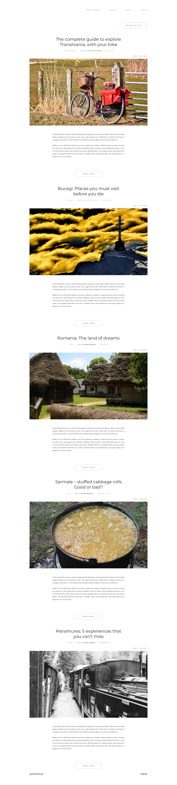
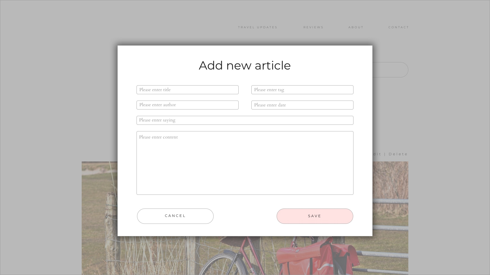

# 3 days in Frontend Journey

The purpose of this project is to give some basic lines to the ones who want to have a start in Frontend Journey in **just 3 days**.

Each day will give the learner the opportunity to read and understand theoretical concepts and also to solve exercises to obtain a functional travelling blog. At the end, the user will be able to execute the CRUD actions (Create, Read, Update and Delete) on the articles, displayed as in the [provided design](#design).

## Technical requirements

We just need:

- [Modern browser](https://browsehappy.com/)
- [Visual Studio Code](https://code.visualstudio.com/Download)
- [Git](https://git-scm.com/download/win)
- [NodeJS](https://nodejs.org/en/)
- [JSON Server](https://github.com/typicode/json-server)

## The agenda

The agenda has the following content:

- Day 1 : HTML & CSS
  - [Introduction](Day-1_HTML-CSS/Theory/README.md)
  - [Exercise](Day-1_HTML-CSS/Exercise/README.md)
- Day 2 : Basic JavaScript
  - [Introduction](Day-2_Basic-JS/Theory/README.md)
  - [Exercise](Day-2_Basic-JS/Exercise/README.md)
- Day 3 : More JavaScript
  - [Introduction](Day-3_More-JS/Theory/README.md)
  - [Exercise](Day-3_More-JS/Exercise/README.md)

## Design

You can find all design specifications in
[Design Information Section](Day-1_HTML-CSS/Exercise/Design/README.md).

### Articles

### Modal

